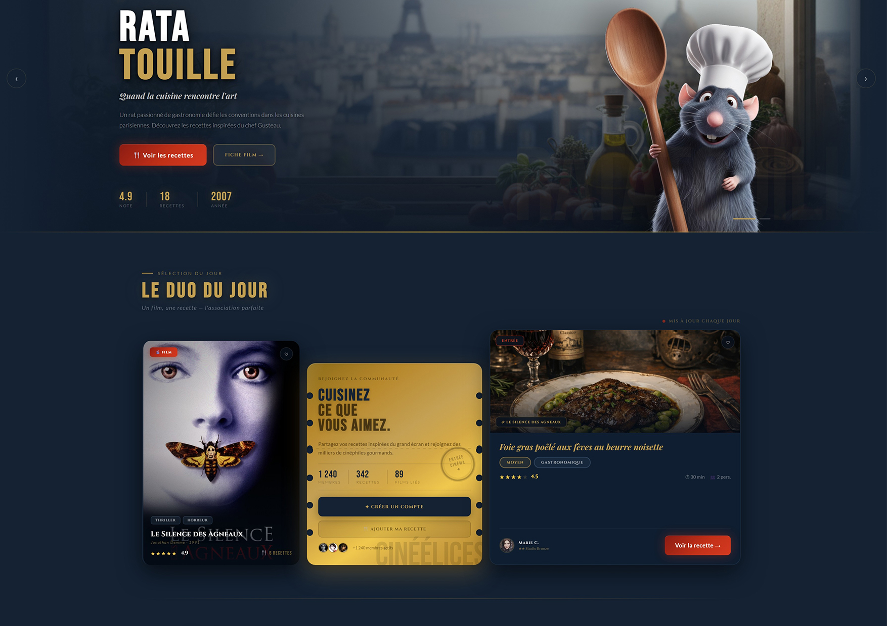
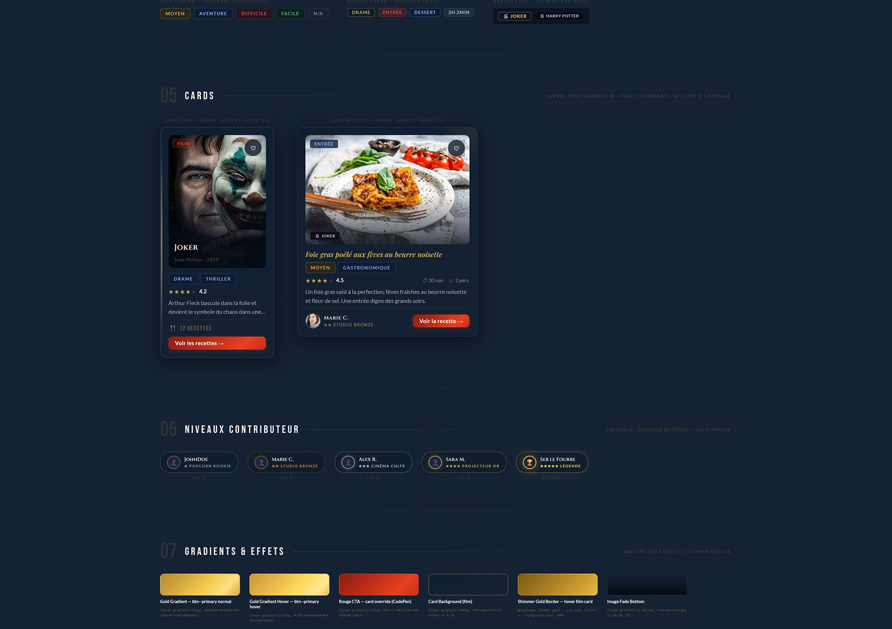

# Portfolio — Sébastien Maurice

**Front-End Developer / UX-Focused**  
[Voir le portfolio en ligne](https://sebastienmaurice.github.io)



---

## 🎯 Qui je suis

Designer graphique devenu développeur front-end, je construis des interfaces **UX-friendly** où le code rencontre le design.  
Ce portfolio montre mon approche : **code propre, animations maison, design réfléchi**, le tout sans framework ni librairie externe.

---

## 💡 Ce que ce portfolio démontre

- **CSS artisan** : animations, glassmorphism, typographies et effets faits main.
- **JavaScript vanilla** : terminal animé, moteur de particules, scroll interactions, tout documenté et lisible.
- **Profil hybride** : UX & design + front-end solide. Chaque décision visuelle a sa logique technique.



---

## ⚙️ Choix techniques

- **HTML5 / CSS3 / JS (ES6+)** — zéro dépendance
- **Canvas 2D** pour le système de particules
- **CSS variables** pour palette, typographie et easing
- **Git / GitHub Pages** pour versioning et déploiement
- **Figma** pour maquettes et direction artistique

---

## 📌 Points d’attention

- Optimisé pour desktop : certaines animations peuvent être lourdes sur mobile.
- Images projets : toutes locales dans `/assets/img`.
- CV PDF et contenu à compléter.

---

## 📂 Organisation du projet

```text
index.html
/css/style.css
/js/main.js
/assets/img/…


📫 Me contacter

 · Email : overseb75@gmail.com

 · LinkedIn : https://www.linkedin.com/in/sebastien-maurice/
 · Malt : https://www.malt.fr/profile/semauri
 · GitHub : https://github.com/sebastienmaurice

Disponible en freelance et ouvert aux opportunités CDI — Remote OK.
Caudry, Nord, France

Formé à O'Clock · Licence Design Graphique Paris VIII · DESS infographie et multimédia Paris VIII · 5+ ans d'expérience web
```
